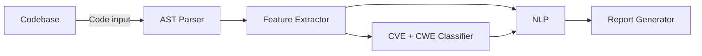

# Automated Source Code Problem Classification using NLP and Syntactic Analysis

Repository for a project developed as part of an engineering thesis.
The goal of the project is to create a comprehensive system for detecting, classifying, and suggesting fixes for security vulnerabilities and bugs in source code, utilizing abstract Syntax Tree (AST) analysis with Natural Language Processing (NLP) techniques and Graph Neural Networks (GNN). The system identifies various types of issues including security vulnerabilities (CVE), common weaknesses (CWE), implementation errors, code duplication, function complexity, structural problems, and logical errors.

## 📊 Supported Languages

**Primary Focus**: C, C++, Java
**Extended Support**: Go, Python, JavaScript/TypeScript

## Project Goals

- **Primary Objective**: Develop an automated source code analysis system that detects and classifies multiple problem categories
- **Technical Innovation**: Combine structural analysis (AST/GNN) with linguistic analysis (NLP) for comprehensive code evaluation
- **Benchmarking**: Compare classification quality against existing static analysis tools
- **Practical Application**: Create a prototype with basic user interface for real-world code analysis

## Technical Approach

### Core Technologies

- **Graph Neural Networks (GNN)** for structural code analysis
- **Natural Language Processing** for comment and identifier analysis
- **Abstract Syntax Trees (AST)** for code structure representation
- **Compact Abstract Graphs (CAG)** for optimized graph representation

### Problem Categories

- Security vulnerabilities (CVE mapping)
- Common weakness enumeration (CWE classification)
- Code quality issues
- Implementation errors and misconfigurations
- Code duplication detection
- Function complexity analysis
- Project structure violations
- Logical errors

## Project Structure

- `data/`: Stores input data (raw code, vulnerability datasets) and processed data (AST graphs, tokens).
- `notebooks/`: Jupyter Notebooks used for data exploration, model prototyping, and result visualization.
- `examples/`: Example source code files used for testing and demonstration purposes.
- `src/gnn_vuln_detection/`: Main application source code, divided into modules responsible for:
  - `code_representation/`: Code parsing, building AST graphs, CFG, DFG, etc.
  - `models/`: GNN model implementations (standard, heterogeneous, siamese, hybrid).
  - `nlp_integration/`: Modules for integration with language models (e.g., Transformers).
  - `vulnerability_detection/`: Vulnerability detection logic.
  - `cwe_classification/`: Vulnerability classification logic according to CWE.
  - `training/`: Scripts and functions for model training.
  - `data_processing/`: Tools for loading and processing data.
  - `utils/`: Helper functions.
- `scripts/`: Scripts for running specific tasks (e.g., preprocessing, training, evaluation).
- `tests/`: Unit and integration tests.
- `docs/`: Project documentation.
- `config/`: Configuration files for models, training, and data paths.

## Prerequisites

- Python 3.8+
- pip
- 8 GB+ RAM
- Some compute power (GPU recommended for training)

## Installation

1. Clone the repository:

```bash
git clone https://github.com/YOUR_GITHUB_ACCOUNT/gnn-nlp-vuln-detection-thesis.git
cd gnn-nlp-vuln-detection-thesis
```

1. (Optional, recommended) Create and activate a virtual environment:

```bash
python -m venv venv
source venv/bin/activate  # On Windows: venv\Scripts\activate
```

1. Install dependencies:

```bash
pip install -r requirements.txt

# tree-sitter package might need separate installation
# Use `git clone https://github.com/tree-sitter/tree-sitter-c.git` for C language support and similar for others
# Then build them properly according to their documentation

```

## Quick Start Guide

### Basic Usage

```python
from code_classifier import CodeAnalyzer

# Initialize analyzer
analyzer = CodeAnalyzer(language='java')

# Analyze single file
results = analyzer.analyze_file('path/to/code.java')

# Analyze entire project
project_results = analyzer.analyze_project('path/to/project/')

# Generate report
analyzer.generate_report(results, format='json')
```

## 🏗️ System Architecture



## Training Datasets

### Academic Datasets

- **CVEfixes**: 12,107 commits covering 11,873 CVE vulnerabilities across 27 languages
- **MegaVul**: 17,380 vulnerabilities from 992 C/C++ repositories
- **DiverseVul**: 18,945 vulnerable and 330,492 non-vulnerable C/C++ functions
- **Juliet Test Suite**: 28,881 Java test cases and 57,000 C/C++ cases covering CWE categories

### Benchmark Repositories

- **OWASP Benchmark**: 3,000 exploitable Java test cases
- **OWASP WebGoat**: 100+ interactive vulnerability lessons
- **Damn Vulnerable Golang**: Go-specific vulnerability examples
- **vulnerable-code-examples**: Multi-language vulnerability collection

## Evaluation Metrics

### Quality Metrics

- **Precision, Recall, F1-score** per problem category
- **Overall Accuracy** on test datasets
- **Confusion Matrix** analysis
- **AUC** for probabilistic classification

### Performance Metrics

- **Analysis Speed** (ms/LOC)
- **Memory Usage** during analysis
- **Throughput** (files per minute)
- **Scalability** with project size

### Comparative Analysis

- **Benchmark** against SonarQube, CodeQL, ESLint, Bearer, Grype, OSV-Scanner, and other tools
- **False Positive Rate** comparison
- **Coverage Analysis** - percentage of real problems detected
- **Time-to-Detection** for different vulnerability types

## 🔍 Example Classifications

### Security Vulnerability Detection

```java
// Detected: SQL Injection (CWE-89)
String query = "SELECT * FROM users WHERE id = " + userId;
Statement stmt = connection.createStatement();
ResultSet rs = stmt.executeQuery(query);
```

### Code Quality Issues

```java
// Detected: Excessive Function Length
public void processData() {
    // 200+ lines of code
    // Recommendation: Refactor into smaller methods
}
```

## Research References

1. Luo, Yu, et al. "Compact abstract graphs for detecting code vulnerability with GNN models." ACSAC 2022.
2. Zhou, Yaqin, et al. "Devign: Effective vulnerability identification by learning comprehensive program semantics via graph neural networks." NeurIPS 2019.
3. Cao, Sicong, et al. "Bgnn4vd: Constructing bidirectional graph neural-network for vulnerability detection." IST 2021.
4. Thapa, C., et al. "Transformer-Based Language Models for Software Vulnerability Detection." arXiv:2204.03214, 2022.
5. Hanif, Hazim, and Sergio Maffeis. "Vulberta: Simplified source code pre-training for vulnerability detection." IJCNN 2022.

## Contributing

### Development Setup

1. Fork the repository
2. Create feature branch (`git checkout -b feature/amazing-feature`)
3. Install development dependencies (`pip install -r requirements-dev.txt`)
4. Run tests (`python -m pytest tests/`)
5. Submit pull request

### Code Style

- Follow PEP 8 conventions
- Use type hints for function signatures
- Maintain test coverage >90%
- Document all public APIs

### Adding New Languages

1. Implement language-specific AST parser
2. Add language to supported list
3. Create test cases for new language
4. Update documentation

## License

This project is licensed under the MIT License - see the [LICENSE](LICENSE) file for details.

## Support

For questions, issues, or contributions:

- Open an [Issue](../../issues) for bug reports
- Submit [Pull Requests](../../pulls) for contributions
- Contact: [project-email@domain.com]

## Academic Use

This project is designed for educational and research purposes. When using this work in academic publications, please cite:

```bibtex
@misc{automated-code-classification,
  title={Automatic classification of problems in source code using NLP techniques and syntactic analysis.},
  author={[Mieszko Połonczyk]},
  year={2026},
  note={Engineering Thesis Project}
}
```

---

**Status**: In Development | **Version**: 0.1.0-alpha | **Last Updated**: June 2025
